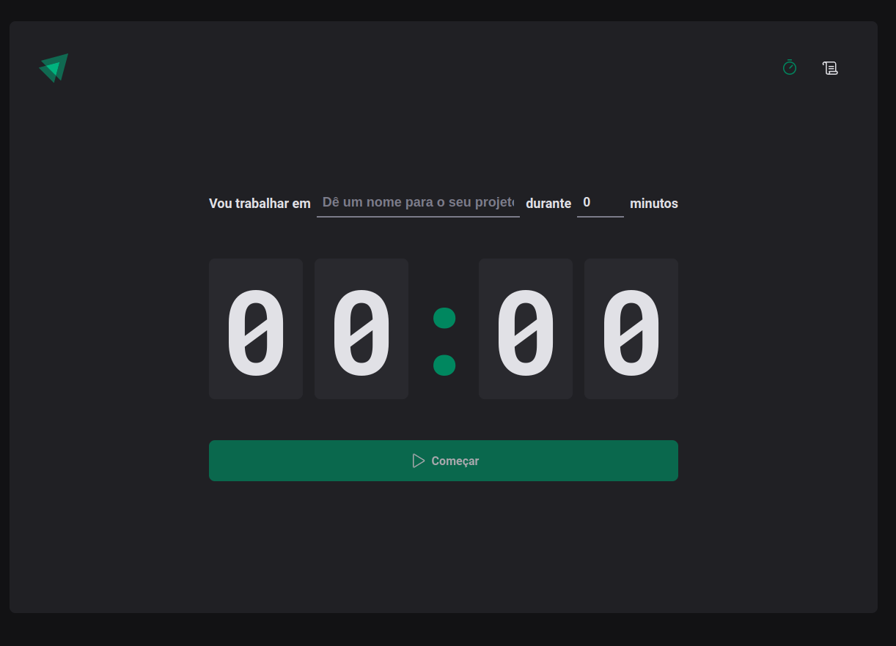
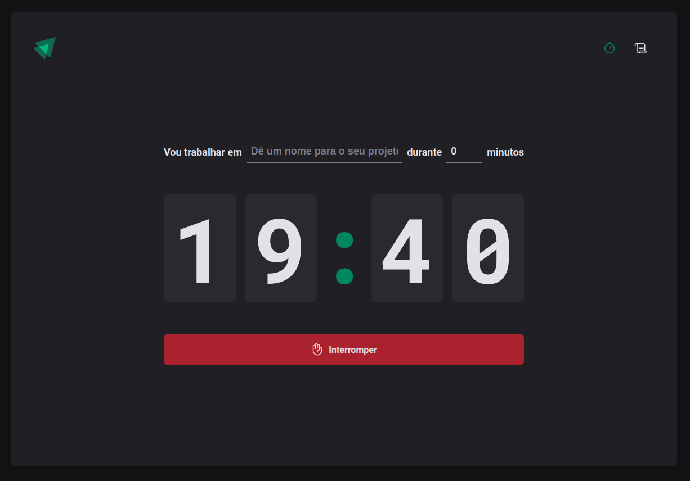
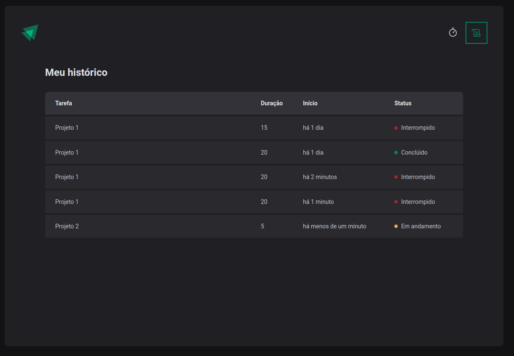

<!-- Improved compatibility of back to top link: See: https://github.com/othneildrew/Best-README-Template/pull/73 -->
<a name="readme-top"></a>
<!--
*** Thanks for checking out the Best-README-Template. If you have a suggestion
*** that would make this better, please fork the repo and create a pull request
*** or simply open an issue with the tag "enhancement".
*** Don't forget to give the project a star!
*** Thanks again! Now go create something AMAZING! :D
-->


<!-- PROJECT SHIELDS -->
<!--
*** I'm using markdown "reference style" links for readability.
*** Reference links are enclosed in brackets [ ] instead of parentheses ( ).
*** See the bottom of this document for the declaration of the reference variables
*** for contributors-url, forks-url, etc. This is an optional, concise syntax you may use.
*** https://www.markdownguide.org/basic-syntax/#reference-style-links
-->
[![Contributors][contributors-shield]][contributors-url]
[![Forks][forks-shield]][forks-url]
[![Stargazers][stars-shield]][stars-url]
[![Issues][issues-shield]][issues-url]
[![LinkedIn][linkedin-shield]][linkedin-url]
[![Contributors][contributors-shield]][contributors-url]

  <a href="https://github.com/Robetjunior/timer-pomodoro">
    
  </a>
  <a href="https://github.com/Robetjunior/timer-pomodoro">
    
  </a>
  <a href="https://github.com/Robetjunior/timer-pomodoro">
    
  </a>


<h3 align="center">Timer Pomodoro</h3>


<!-- ABOUT THE PROJECT -->
## About The Project

[![Product Name Screen Shot][product-screenshot]](https://example.com)

Timer Pomodoro tem o intuito de ser um projeto desenvolvido para gerir melhor o tempo e aumento de produtividade mais fáceis de serem implementados no dia a dia. Além de aprimorar as minhas habilidades com Typescript, ReactJS utilizando Contexto no React, Reducers e Actions.

<p align="right">(<a href="#readme-top">back to top</a>)</p>


<!-- GETTING STARTED -->
## Getting Started

This is an example of how you may give instructions on setting up your project locally.
To get a local copy up and running follow these simple example steps.

### Prerequisites

This is an example of how to list things you need to use the software and how to install them.
* npm
  ```sh
  npm install npm@latest -g
  ```

### Installation

1. Clone the repo
   ```sh
   git clone https://github.com/Robetjunior/timer-pomodoro.git
   ```
2. Install NPM packages
   ```sh
   npm install
   ```
3. Start the project using
   ```
   npm run dev
   ```

<p align="right">(<a href="#readme-top">back to top</a>)</p>


<!-- USAGE EXAMPLES -->
## Usage

Use this space to show useful examples of how a project can be used. Additional screenshots, code examples and demos work well in this space. You may also link to more resources.

_For more examples, please refer to the [Documentation](https://example.com)_

<p align="right">(<a href="#readme-top">back to top</a>)</p>


<!-- CONTRIBUTING -->
## Contributing

Contributions are what make the open source community such an amazing place to learn, inspire, and create. Any contributions you make are **greatly appreciated**.

If you have a suggestion that would make this better, please fork the repo and create a pull request. You can also simply open an issue with the tag "enhancement".
Don't forget to give the project a star! Thanks again!

1. Fork the Project
2. Create your Feature Branch (`git checkout -b feature/AmazingFeature`)
3. Commit your Changes (`git commit -m 'Add some AmazingFeature'`)
4. Push to the Branch (`git push origin feature/AmazingFeature`)
5. Open a Pull Request

<p align="right">(<a href="#readme-top">back to top</a>)</p>


<!-- LICENSE -->
## License

Distributed under the MIT License. See `LICENSE.txt` for more information.

<p align="right">(<a href="#readme-top">back to top</a>)</p>


<!-- CONTACT -->
## Contact

Project Link: [https://github.com/Robetjunior/timer-pomodoro/](https://github.com/Robetjunior/timer-pomodoro/)

<p align="right">(<a href="#readme-top">back to top</a>)</p>


<!-- MARKDOWN LINKS & IMAGES -->
<!-- https://www.markdownguide.org/basic-syntax/#reference-style-links -->
[contributors-shield]: https://img.shields.io/github/contributors/Robetjunior/timer-pomodoro.svg?style=for-the-badge
[contributors-url]: https://github.com/Robetjunior/timer-pomodoro/graphs/contributors
[forks-shield]: https://img.shields.io/github/forks/Robetjunior/timer-pomodoro.svg?style=for-the-badge
[forks-url]: https://github.com/Robetjunior/timer-pomodoro/network/members
[stars-shield]: https://img.shields.io/github/stars/Robetjunior/timer-pomodoro.svg?style=for-the-badge
[stars-url]: https://github.com/Robetjunior/timer-pomodoro/stargazers
[issues-shield]: https://img.shields.io/github/issues/Robetjunior/timer-pomodoro.svg?style=for-the-badge
[issues-url]: https://github.com/Robetjunior/timer-pomodoro/issues
[license-shield]: https://img.shields.io/github/license/Robetjunior/timer-pomodoro.svg?style=for-the-badge
[license-url]: https://github.com/Robetjunior/timer-pomodoro/blob/master/LICENSE.txt
[linkedin-shield]: https://img.shields.io/badge/-LinkedIn-black.svg?style=for-the-badge&logo=linkedin&colorB=555
[linkedin-url]: https://linkedin.com/in/josé-roberto-dev/